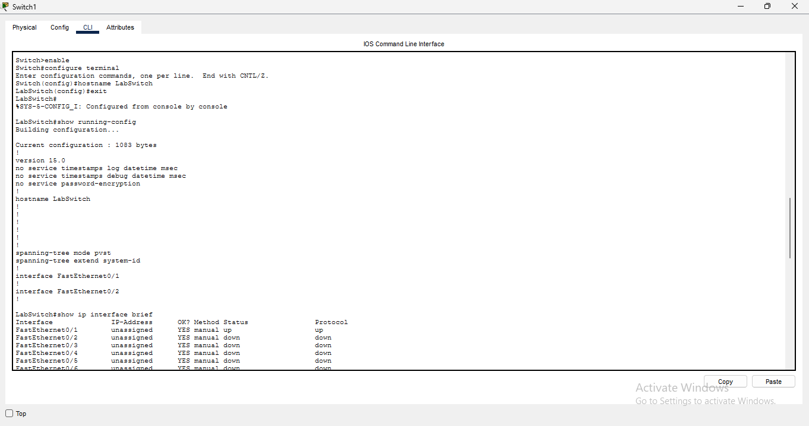
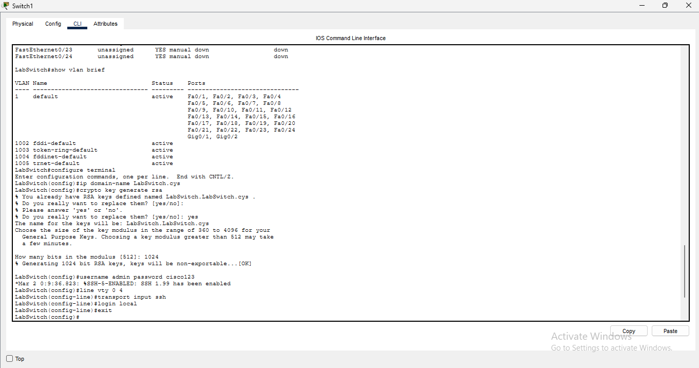

# Enterprise & Industrial Security Lab 🛡️

This repository contains my academic practical assignments performed during the B.Sc. (Cyber Security) curriculum at Government Holkar Science College.

## Assignment 1: Network Switches Configuration & OpenSSH Setup

### 🎯 Objectives Covered:
- Navigated between User Exec, Privilege Exec, and Global Configuration modes.
- Configured device identifier using the `hostname LabSwitch` command.
- Defined a domain name network architecture via `ip domain-name LabSwitch.cys`.
- Generated 1024-bit RSA keys to implement secure remote access using OpenSSH.
- Configured local authentication (`username` & `password`) and restricted remote lines to SSH using `transport input ssh`.
- Executed system maintenance procedures utilizing `write erase` and system `reload`.

### 💻 CLI Execution & Evidence:
Below are the step-by-step terminal outputs showing the successful execution of all Cisco IOS commands:

| CLI Part 1 (Basic Setup & Key Generation) | CLI Part 2 (SSH & Line Configuration) |
| --- | --- |
|  |  |

---
### 🛠️ Tools Used:
- **Cisco Packet Tracer v9.0.0** (Network Simulation)
- **Cisco IOS** (2960 Series Switch Catalyst)
